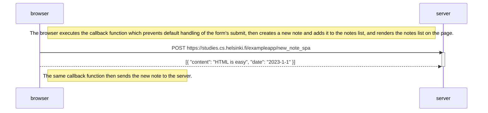

# 0.6

```mermaid
sequenceDiagram
    participant browser
    participant server

    Note right of browser: The browser executes the callback function which prevents default handling of the form's submit, then creates a new note and adds it to the notes list, and renders the notes list on the page.

    browser->>server: POST https://studies.cs.helsinki.fi/exampleapp/new_note_spa
    activate server
    browser-->>server: [{ "content": "HTML is easy", "date": "2023-1-1" }]
    deactivate server

    Note right of browser: The same callback function then sends the new note to the server.
```
